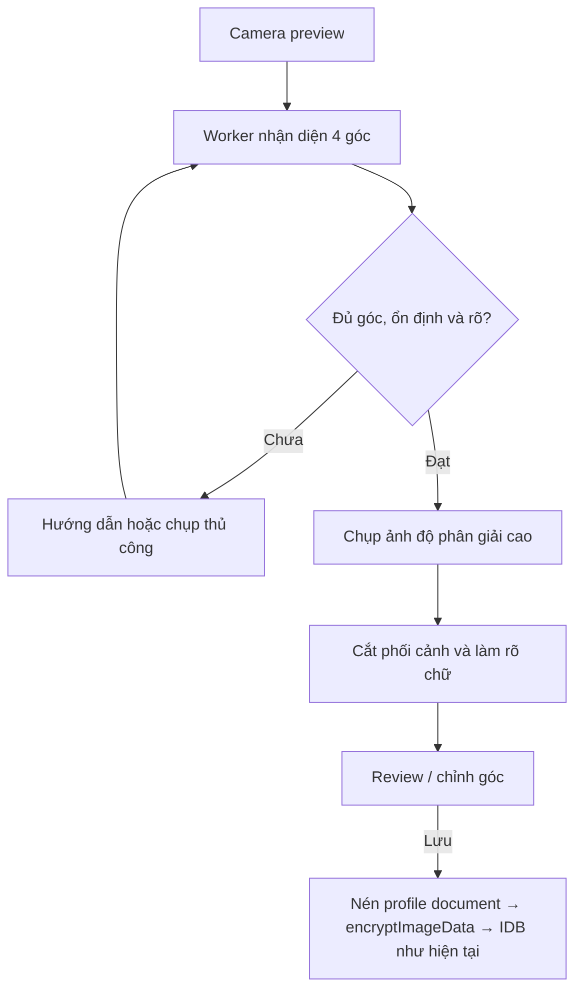

# Plan: UX, hiệu năng khởi động & Quét giấy tờ → v1.5.0

> **Trạng thái:** kế hoạch khóa phạm vi — **chưa triển khai mã nguồn**.  
> **Baseline khóa:** `main` @ `c4264af48aa81a27b1ddf8fdb745efdec2d558d3` (`c4264af`).  
> **Phiên bản hiện tại:** `1.4.8` (`package.json`).  
> **Release mục tiêu:** `1.5.0` (minor — tính năng hướng người dùng).  
> **Nhánh triển khai đề xuất:** tách từ baseline trên; commits theo nhóm `perf` → `ux-camera` → `feat-docscan` → `tests` → `release`.

Tài liệu này là hợp đồng phạm vi trước khi viết code. Mọi PR triển khai phải bám allowlist và cổng nghiệm thu bên dưới. Không merge production nếu Performance hoặc độ chính xác scanner không đạt gate.

---

## 1. Chẩn đoán baseline (đã đối chiếu mã nguồn)

### 1.1 Hiệu năng khởi động

Số liệu tham chiếu (Lighthouse mobile, môi trường đo trước khi lập plan):

| Metric | Baseline (~) |
|---|---:|
| Performance (median) | 68/100 |
| FCP | ~3,0 s |
| LCP | ~10,7 s |
| TBT | 55–100 ms |
| CLS | ~0 |

**Kết luận:** điểm yếu là **luồng khởi động / render**, không phải JS tính toán nặng trên main thread.

Đối chiếu mã tại baseline:

| Hiện tượng | Bằng chứng trong repo |
|---|---|
| 13 modal tải đồng thời | `assets/ui/load_modals.js` — `Promise.all` trên 13 partial HTML |
| Bootstrap chờ modal tối đa 3 s | `assets/10_bootstrap.js` — `Promise.race([__clientpro_modals_ready, 3000ms])` |
| 5 stylesheet chặn render | `index.html`: `fonts.css`, `tailwind.clientpro.css`, `app.patch.css`, `styles.css`, `redesign.clientpro.css` (+ lazy CSS PDF/ĐVHC chưa nằm trên cold path) |
| 12 file font weight × subset | `assets/fonts/be-vietnam-pro-{400,500,600,700,800,900}-{latin,vietnamese}.woff2`; preload 4 file (400/700 × 2 subset) |
| Icon scan toàn document lúc boot | `10_bootstrap.js` gọi `lucide.createIcons()` không `root` |
| ~60 request cold load | shell + 5 CSS + font + vendor + ~28 script + 13 modal |

### 1.2 Camera / ảnh hiện tại

Trong `assets/08_images_camera.js` tại baseline:

- Chụp khung hình bằng `canvas.drawImage(video)` — không detect mép giấy, không perspective warp.
- `compressImage`: cạnh dài tối đa **2200 px**, mục tiêu **500–700 KB**.
- JPEG quality có thể giảm tới **0.5** khi ảnh lớn → chữ nhỏ dễ nhòe.
- Đường ghi: compress → `encryptImageData` → IndexedDB transaction trong `saveImageToDB` (fail-closed đã có test).

### 1.3 Lighthouse CI hiện tại

`lighthouserc.json`: Performance vẫn là **`warn`** với `minScore: 0.5`. Plan này sẽ nâng assertion Performance theo mục tiêu §4 sau khi P1–P4 xanh trên Preview (CI Python static server không phản ánh compression/cache production — đo CI và Vercel Preview **riêng**).

---

## 2. Phạm vi thay đổi (khóa)

### 2.1 Được nâng cấp

| Khu vực | Nội dung |
|---|---|
| Khởi động / first paint | Tách modal critical vs nghiệp vụ; giảm CSS/font blocking; scope icon; idle work |
| CSS / font / icon / modal loading | Chỉ thời điểm tải + tách file; **không** redesign màn hình nghiệp vụ |
| UX loading / phản hồi thao tác | Trạng thái sớm, lazy-load ≤100 ms feedback, chống double-tap |
| Camera + document scanner | Xử lý ảnh **trước** mã hóa/lưu; chế độ Quét giấy tờ mặc định |
| Test / docs / cache inventory / version | Fixture giấy tờ giả; unit/e2e/LH; bump 1.5.0 theo quy trình hiện có |

### 2.2 Không được chỉnh logic

Các module / invariant sau **cấm** thay đổi hành vi (chỉ được đụng chuỗi version/cache khi release):

- `02_security.js`, masterKey, PIN, WebAuthn, crypto schema, ciphertext rules.
- IndexedDB tên/schema/version, store `customers` / `images` / `backups`.
- Backup/restore, Drive, GAS, cloud transfer, auto-backup.
- Customers, assets, map, PDF Toolkit, ĐVHC Lookup (logic nghiệp vụ).
- CSP, API endpoint, dữ liệu đã lưu.
- Luồng upload ảnh thường lên Drive.
- **Từ `encryptImageData()` đến transaction ghi** trong `saveImageToDB()` — giữ nguyên. Ngoại lệ API: thêm tham số tùy chọn `compressionProfile: "document"` **trước** bước encrypt; khối encrypt + IDB không đổi.

### 2.3 Ngoại lệ release

Đồng bộ `package.json` → `ASSET_V` / `?v=` / `MAPLIBRE_V` / `LAZY_MODULES_V` / `manifest` / `pwa.js` / `README` / precache `sw.js` theo `npm run sync:version` + `check-policy`. Không sửa logic các module đó ngoài cache-buster.

### 2.4 `10_bootstrap.js` — biên chỉnh sửa

- **Được:** phần trước khi mở IndexedDB (chờ `criticalReady` thay vì toàn bộ modal; scope `createIcons`; thông điệp loading).
- **Cấm:** mở DB, migration, AuthGate, auto-lock, revocation, auto-backup hooks. Bảo vệ bằng regression tripwire + hash file trước/sau.

---

## 3. Trình tự triển khai

Không ước lượng lịch làm việc theo ngày; mỗi giai đoạn khóa **đầu ra kỹ thuật** và phụ thuộc.

| Giai đoạn | Công việc chính | Đầu ra khóa | Phụ thuộc / rủi ro |
|---|---|---|---|
| **P0** | Khóa baseline, ngân sách hiệu năng, fixture giấy tờ giả | Branch từ `c4264af`; bảng budget; bộ ảnh test (không PII) | Không đụng app logic |
| **P1** | Cold start: modal, CSS, font, icon, idle init | FCP/LCP cải thiện rõ trên Preview; request ≤40 hướng tới | Visual regression dashboard/business không đổi |
| **P2** | UX loading + camera mode switch (chưa detector) | Gate/loader sớm; camera mặc định Quét; chế độ Ảnh thường = cũ | Không lazy-load chặn AuthGate |
| **P3** | Document detection, crop, sharpen, review | Module `document-scanner/*` + worker; review UI | Không OpenCV.js/OCR/cloud; stop-the-line nếu detector nhỏ fail P4 |
| **P4** | Unit, e2e, thiết bị thật, LH, regression | Gate §7 xanh; 349 unit + 71 e2e hiện có pass | Thiết bị thật **không rút** — quyết định độ rõ chữ / cắt góc |
| **P5** | Bump `1.5.0`, Preview, production, tag | Chỉ khi toàn bộ gate xanh | Không bump nếu Performance hoặc scanner không đạt |

**Thứ tự commit đề xuất trên một branch triển khai:**

1. `perf:` modal critical + CSS/font/icon/idle  
2. `ux(camera):` chế độ Quét / Ảnh thường + loading copy  
3. `feat(docscan):` worker + geometry + enhance + review  
4. `test:` unit/e2e/fixture/LH assertion  
5. `chore(release):` 1.5.0 + sync version/ASSET_V  

---

## 4. Plan hiệu năng (P1)

### P1.1 — Tách modal critical / nghiệp vụ

**Hiện tại:** `load_modals.js` tải cả 13 file; bootstrap race 3 s.

**Thay đổi:**

1. **Critical (chờ trước bootstrap tiếp tục):**  
   `activation-modal`, `setup-lock-modal`, `screen-lock`, `forgot-pin-modal`, `biometric-setup-modal`.
2. Bootstrap chỉ `await criticalReady` (vẫn có timeout an toàn; không kéo dài chờ nghiệp vụ).
3. Modal nghiệp vụ: tải khi mở lần đầu **hoặc** idle sau first paint.
4. Thêm `ModalLoader.ensure(id)` — mọi `data-action` mở modal phải `ensure` trước; phản hồi ≤100 ms (disabled/spinner), chống double-tap, lỗi có thể thử lại.
5. Giữ nguyên HTML, DOM id, `data-action` — chỉ đổi **thời điểm** tải.
6. `camera-modal` (+ scanner assets) lazy khi bấm **Chụp**.

### P1.2 — Giảm CSS chặn render

Dùng CSS coverage để tách **nguyên trạng selector** thành:

- **core:** token, loader, security gate, dashboard first paint.
- **feature:** camera, gallery, backup, map, modal nghiệp vụ, (sau này) document-scanner.

Chỉ di chuyển selector — **không** redesign đồng thời. Feature CSS tải trước khi mở feature tương ứng. Mục tiêu: từ **5** render-blocking stylesheet xuống **2–3**. Visual regression: không đổi ngoài màn camera/scanner.

### P1.3 — Font variable

- Thay 12 file static weight bằng **2** variable WOFF2 tự host: Latin + Vietnamese.
- Preload đúng 2 file cần; dải weight **400–900** giữ nguyên; không đổi họ font / typography.
- Không request Google/CDN. Pin SHA-256 trong `assets/vendor/README.md` / inventory font (cùng policy `check-policy.mjs`).

### P1.4 — Giảm công việc first paint

- `lucide.createIcons({ root })` chỉ trên security gate / dashboard đang hiện — **không** quét toàn `document` lúc boot (unscoped vẫn dành cho trường hợp boot tối thiểu nếu cần, ưu tiên scoped).
- Weather và initializer chỉ mang tính trình bày: sau first paint / `requestIdleCallback` (fallback `setTimeout`).
- **Không** trì hoãn: DB open, AuthGate, auto-lock, revocation, auto-backup.
- Scanner worker / CSS / thuật toán **không** nằm trên cold-start path (lazy khi mở camera).

### Mục tiêu hiệu năng (release gate)

| Metric | Gate |
|---|---|
| Lighthouse mobile CI median | ≥ **85**; không run nào &lt; **80** |
| Vercel Preview (mục tiêu) | **90+** |
| FCP | ≤ **1,8 s** |
| LCP | ≤ **2,8 s** |
| TBT | ≤ **150 ms** |
| CLS | ≤ **0,02** |
| Initial request | ≤ **40** |
| Cold-load transfer | ≤ **1 MB** |
| Accessibility / Best Practices | giữ **100/100** (hoặc không tụt so với baseline CI assert) |

Đo CI (Python static) và Vercel Preview **riêng**; chỉ Preview dùng để quyết định “đạt cảm nhận production”.

---

## 5. Plan UX (P2 + phần UI P3)

### 5.1 Khởi động

- Security gate hoặc loading có nội dung xuất hiện **frame đầu** — không loader trắng chờ đủ 13 modal.
- Copy ngắn, đúng tiến trình: ví dụ **「Đang chuẩn bị dữ liệu trên thiết bị」** (bám `docs/terminology.md`: lịch sự, ngắn, xưng `bạn`).
- Dashboard render dần; không chờ weather / modal nghiệp vụ.
- Mọi lazy-load: phản hồi ≤100 ms, chống double-tap, lỗi retry được.

### 5.2 Camera

- Mặc định mở **Quét giấy tờ**.
- Nút chuyển **Ảnh thường** — hành vi cũ (drawImage + compress hiện tại) giữ nguyên.
- Overlay bốn cạnh khi detect.
- Hướng dẫn theo trạng thái:
  - 「Đưa đủ 4 góc giấy tờ vào khung」
  - 「Đưa gần hơn」
  - 「Thiếu sáng」
  - 「Giữ yên」
  - 「Ảnh chưa đủ nét」
  - 「Sẵn sàng chụp」
- Vẫn có nút chụp thủ công.
- Sau chụp giấy tờ — màn **review**: Chụp lại · Chỉnh 4 góc · Xoay 90° · Lưu.
- Touch target ≥44 px, safe-area, screen reader, `prefers-reduced-motion`.

---

## 6. Document Scanner (P3)



### P3.1 — Camera session

- Snapshot `customerId` / `assetId` / `captureMode` **ngay khi mở** camera (cùng invariant upload path hiện có).
- Ưu tiên constraint độ phân giải cao.
- Đọc `MediaStreamTrack.getCapabilities()` trước khi bật continuous focus / torch / zoom; áp dụng qua `applyConstraints()` — không giả định thiết bị.
- `ImageCapture.takePhoto()` khi hỗ trợ; fallback frame video hiện tại.

### P3.2 — Phát hiện giấy tờ (module riêng)

**Không** nhét thuật toán vào `08_images_camera.js`. Cấu trúc đề xuất:

```
assets/document-scanner/
  document-scanner.js          # session API, gắn camera UI
  document-detector.worker.js  # pipeline detect trên worker
  document-geometry.js         # quad score, order corners, homography helpers
  document-image-enhance.js    # WB / contrast / denoise / unsharp (giới hạn)
assets/css/document-scanner.css
```

Pipeline detect (preview downscale cạnh dài **640–768 px**):

1. Grayscale + cân bằng tương phản cục bộ  
2. Sobel / Canny  
3. Morphological close  
4. Contour lớn → simplify polygon  
5. Chấm điểm quadrilateral: diện tích, độ lồi, 4 góc, rectangularity, khoảng cách biên  
6. Order: TL → TR → BR → BL  
7. Theo dõi **6–10** frame; auto-capture khi drift góc &lt; **2%** trong **700–900 ms**

Chạy trên **Web Worker** + **OffscreenCanvas**. Frame: `requestVideoFrameCallback` khi có; fallback throttle **3–4 FPS** máy cũ.

**Cấm bản này:** OCR, OpenCV.js nặng, dịch vụ cloud. Nếu detector nhỏ **không** đạt tiêu chí P4 → **dừng release**, xin duyệt riêng WASM dependency — không âm thầm phình bundle.

### P3.3 — Không cắt mép giấy

- Outward safety margin ~**1%** từ 4 góc; clamp biên ảnh.
- Từ chối auto-capture nếu một cạnh giấy **chạm biên** camera.
- Chạy lại detect trên ảnh tĩnh full-res.
- Nếu tỷ lệ ảnh tĩnh ≠ preview và không detect lại được → **chỉnh góc thủ công**; không crop đoán.
- Warp homography từ **ảnh gốc**, không từ preview đã thu nhỏ.

### P3.4 — Làm rõ chữ + nén document

Trước auto-capture: variance Laplacian / Tenengrad trên vùng giấy; kiểm thiếu sáng / cháy sáng / lóa lớn.

Sau crop: white balance nhẹ → local contrast vừa → denoise nhẹ → unsharp có trần. **Không** threshold B&W mặc định (mất nét chữ mảnh / dấu tiếng Việt).

**Compression profile `document`:**

| Tham số | Document | Ảnh thường (giữ cũ) |
|---|---|---|
| Cạnh dài max | 2400 px (nếu nguồn cho phép) | 2200 px |
| JPEG quality start | 0.94 | như hiện tại |
| Quality floor | **0.84** (không xuống 0.5) | có thể tới 0.5 |
| Khi &gt; 700 KB | giảm **kích thước** từng bước | logic cũ |

`saveImageToDB` nhận thêm `compressionProfile: "document"`; sau compress vẫn `encryptImageData` + transaction như cũ.

### P3.5 — Riêng tư & cleanup

- Không gửi frame/ảnh lên mạng; không log base64/blob/nội dung giấy tờ.
- Đóng camera / auto-lock / `pagehide`: stop tracks, terminate worker, cancel frame callback, xóa canvas/review buffer, revoke object URL.
- Khóa app giữa chừng: hủy session, **không lưu**; test fail-closed hiện tại tiếp tục chặn ghi plaintext.

### P3.6 — Offline / SW

Giữ **full precache** để scanner hoạt động offline; asset scanner chỉ **tải/thực thi** khi mở camera (không cold-start). Thêm URL `?v=ASSET_V` vào precache khi có module mới — đồng bộ với `check-policy` / `tests/pwa.test.js`.

---

## 7. Điều kiện nghiệm thu (P4)

| Nhóm | Release gate |
|---|---|
| Auto-detect | ≥95% bộ ảnh đủ sáng; ≥90% ma trận thiết bị/thực tế |
| Sai auto-capture | &lt;2% |
| Cắt góc | Không mẫu chấp nhận nào bị cắt vào mép giấy |
| Nền thừa | ≤ ~2% mỗi cạnh |
| Độ rõ | Chữ 8–10 pt đọc được @ zoom 200% trên bộ test |
| Preview FPS | ≥25 |
| Detector rate | 6–8 lần/giây |
| Main thread | Không long task camera &gt;50 ms |
| Post-capture | ≤1,5 s trên Android tầm trung |
| Fallback | Chụp thủ công + chỉnh góc luôn hoạt động |
| Bảo mật | IndexedDB chỉ ciphertext |
| Regression | Toàn bộ unit + e2e hiện có pass |
| Offline | Mở + xử lý scanner offline |
| A11y | Axe / LH không lỗi mới |

**Bộ fixture:** CCCD giả 2 mặt, A4, hợp đồng, hóa đơn, giấy ép nhựa; nền sáng/tối; nghiêng; thiếu sáng; lóa; thiếu 1 góc. **Không commit giấy tờ thật / PII.**

---

## 8. Kiểm soát không đụng phần khác

1. Một branch triển khai riêng từ baseline `c4264af`.  
2. CI / checklist: `git diff --name-only` theo **allowlist** (modal loader, bootstrap phần đầu, CSS/font, camera UI, `document-scanner/*`, tests, docs, version files).  
3. Hash các file cấm trước/sau (ví dụ `02_security.js`, `12_backup_core.js`, `07_drive.js`, `gas/*`, schema bootstrap block…).  
4. `10_bootstrap.js`: tripwire regression — không đổi migration / AuthGate / backup.  
5. Visual regression: dashboard, khách hàng, tài sản, backup, map, PDF — không đổi ngoài camera/scanner.  
6. **Không merge** nếu diff ngoài phạm vi hoặc gate §4 / §7 đỏ.

### Allowlist dự kiến (triển khai)

```
assets/ui/load_modals.js
assets/ui/modals/camera-modal.html          # chỉ markup mode/review nếu cần
assets/10_bootstrap.js                      # chỉ pre-DB
assets/08_images_camera.js                  # session/UI/compress profile; không đổi encrypt→IDB
assets/00_globals.js                        # ModalLoader / CLICK_ACTIONS nếu cần
assets/document-scanner/**                  # mới
assets/css/**                               # tách core/feature + document-scanner.css
assets/fonts/**                             # variable woff2
assets/styles.css                           # chỉ nếu token/loader cần
index.html                                  # link CSS/font preload; không đổi script order nghiệp vụ tùy tiện
sw.js / manifest / pwa / package / README   # chỉ khi release sync
tests/** / e2e/** / docs/** / lighthouserc.json
scripts/check-policy.mjs                    # chỉ nếu inventory font/precache rule cần
CLAUDE.md                                   # cập nhật khi architecture/entry point đổi (cùng PR triển khai)
```

Mọi path ngoài allowlist = dừng và xin duyệt.

---

## 9. Bump version & phát hành (P5)

1. Chỉ bump **sau** khi unit + e2e + LH + thiết bị thật + policy xanh.  
2. `1.4.8` → **`1.5.0`** (không dùng `1.4.9`).  
3. `npm run sync:version` → `npm run check:version`.  
4. Đồng bộ tay mọi `?v=` trong `index.html`, `MAPLIBRE_V`, `LAZY_MODULES_V` = `ASSET_V` mới.  
5. Chạy bắt buộc:
   - `npm test`
   - `npx playwright test` / `npm run test:e2e`
   - `npx lhci autorun`
   - `node scripts/check-policy.mjs`
   - `node --check` toàn bộ JS mới/sửa  
6. Deploy **Vercel Preview** → kiểm camera thật qua **HTTPS** → mới production + tag `v1.5.0`.  
7. Nếu Performance hoặc scanner không đạt → **không bump**, không production.

### Cập nhật `CLAUDE.md` (khi triển khai, cùng change)

Khi có code thật, cập nhật các mục:

- Directory structure + lazy modules (document-scanner).  
- Script/load rules nếu `ModalLoader` / critical modal thay bootstrap wait.  
- Images/camera: chế độ Quét, `compressionProfile`, cleanup session.  
- Không ghi changelog dài; giữ progressive disclosure theo quy ước hiện có.

---

## 10. P0 — Việc khóa ngay (trước code)

- [x] Xác nhận HEAD = `c4264af` / version `1.4.8`.  
- [x] Đối chiếu `load_modals.js` (13 modal), bootstrap 3 s, 5 CSS, 12 font, `createIcons()` unscoped, compress 2200/q≥0.5.  
- [ ] Ghi ngân sách performance (request/byte/FCP/LCP) vào issue hoặc comment PR triển khai.  
- [ ] Chuẩn bị fixture giấy tờ giả (local/CI artifact, **không** commit PII).  
- [ ] Hash snapshot file cấm trên baseline để so sau.

---

## 11. Quyết định stop-the-line

| Điều kiện | Hành động |
|---|---|
| Detector nhỏ &lt; gate auto-detect / cắt mép | Dừng P5; không WASM lén; mở RFC dependency |
| LH Preview &lt; 80 bất kỳ run / median &lt; 85 | Dừng bump; quay P1 |
| Diff ngoài allowlist hoặc hash file cấm đổi | Revert / tách PR; không merge |
| Fail-closed image / crypto test đỏ | Ưu tiên sửa trong phạm vi camera caller — **không** nới `encryptImageData` |

---

*Tài liệu plan-only. Không thay đổi mã ứng dụng trong bước này.*
